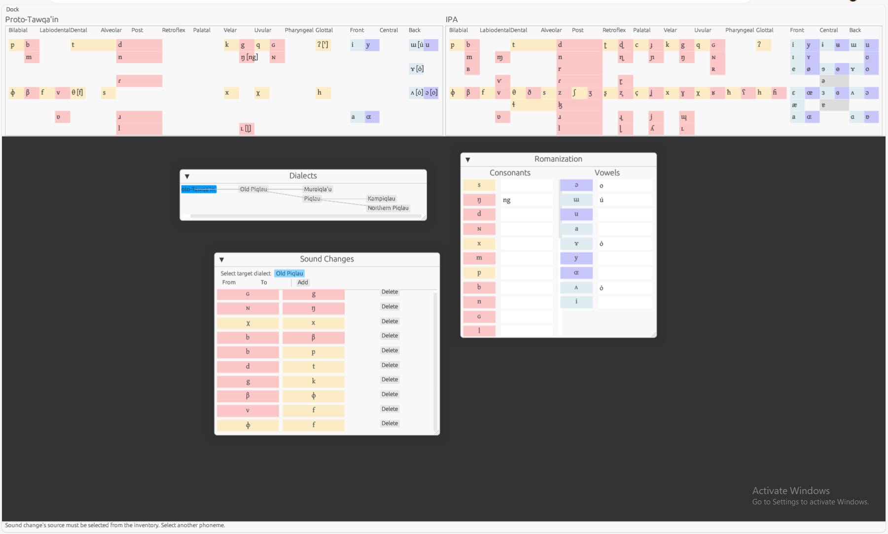

# Phonemenomicon

...is a conlanging tool that, in time, will allow users to create a tree of dialects, perform sound changes between parent and child dialects, and view the resulting influence on an accompanying lexicon.

The project is in its _very_ early stages, but development is rapid.

<kbd>
  
</kbd>

### Next Steps

- Sound change context & application
- Sound change engine
- Lexical evolution
- Improved docking system
- Project export (and import)
- Atypical sound change modelling (metathesis, gemination, etc.)
- Allophonic variation
- Tray for (currently) unrepresentable phonemes
- Much more...